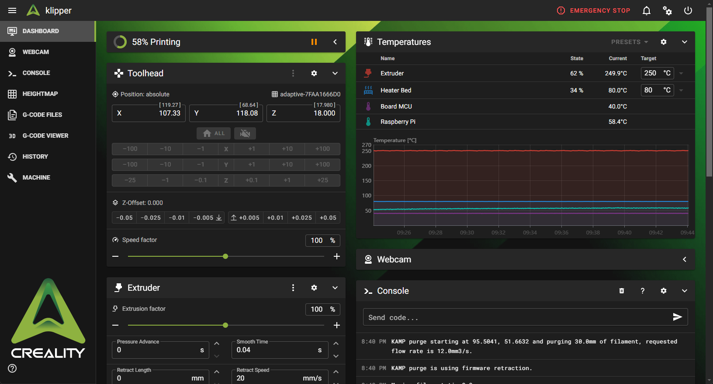

# Creailty for [Mainsail](https://docs.mainsail.xyz/)

> A dark mode Creality theme for [Mainsail](https://github.com/mainsail-crew/mainsail)



## Installation 
```bash
rm -rf ~/printer_data/config/.theme
cd ~
git clone https://github.com/element18592/creality-mainsail-theme.git ~/printer_data/config/.theme
```
## Update
```bash
git -C ~/printer_data/config/.theme pull
```

## More
* Find more themes at [Mainsail Docs - Theming](https://docs.mainsail.xyz/theming)
* Install Mainsail Themes with [KIAUH](https://github.com/th33xitus/kiauh) 
